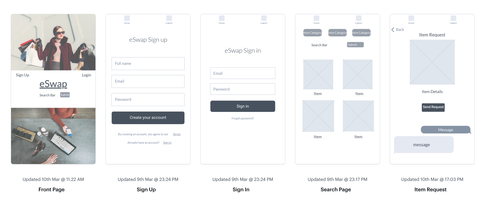

# eSwap (a.k.a. Mando-List)

## Project Description

**eSwap** is an e-commerce site where you can create items to swap, delete items from your own user profile, request another user's item, and swap items(update). Just like eBay you can search for things to "bid on" like electronic equipment, kitchen supplies, clothes, etc. Users will be split into 3 categories - admin, user (authenticated) and guest (unauthenticated). Guests are able to browse, but unable to bid on or upload items. Members are able to upload items for approval, and admins have the ability to update, delete and possibly edit items. Major challenges for the project may include the backend of an e-commerce site as well as overscoping on features. 

### MVP:
-Use React Bootstrap  
-Have a minimum of 1 git commit per day per team member  
-Have the frontend deployed on Surge 
-Have the backend deployed on Heroku 
-Include CRUD on the backend using Express, Mongoose, and MongoDB 
-Have hand-rolled jwt authentication system (included) 
-Use flexbox and/or css grid 
-Include a minimum of 5 components that your team has built 
-Use React Router (included) 
-Look like the mockup/wireframe (or better) 
-Be properly indented and spaced 
-Not include commented out code in the master branch 
-Use camelCase for javascript code 
-Use a color palette generator 
-Include a beautiful, professional README.md (use markdown) 

### Post-MVP:
-“Favoriting”/”Liking” option 
-Email screen within website so that user can request an item 
-Commenting underneath each item for enhanced/quicker user experience 
-Swapping of items 
_Implementing Stripe 

## Feature List 
-Sign Up 
-Sign In 
-Sign Out 
-User can refresh page and still stay signed in 
-Search bar to request items 
-Creating items 
-Retrieving items 
-Updating items 
-Deleting items 
-Email screen directly on website to request an item 
-“favoriting”/”liking” of items 
-Watchlist for favorite items 
-Swapping of items 
-Stripe implementation 

## Entity Relationship Diagram (ERD) 
_Diagram of the database tables, schemas, and relations. You can draw them by hand or try one of these useful links for ERDs:_ 
_-lucidchart - This is a great tool for building ERDs._ 
_-draw.io Another great tool for ERDs._ 
_-ERDPlus Yet another great tool for ERDS._ 

### Items Database:
-Item ID (int) 
-Item Name (String) 
-Description (String) 
-Name(of owner) (String) one to many? 
-Date Uploaded (new Date) 
-Availability (Boolean) 

### Users Database:
-User ID (int) 
-User Name (String) 
-User Description/Role (admin/member/guest?) - String 
-Password 
-Date joined (new Date) 

## API Endpoint Documentations 
_List of all of your servers routes, the structure of requests that you expect and the structure of responses they send._ 

eBay RESTful API: (https://developer.ebay.com/api-docs/static/ebay-rest-landing.html) 

## Wireframes 

https://marvelapp.com/a9jaafd/screen/67084205 

## Component Hierarchy 
_Wireframes should be broken into components which then should be described in a component hierarchy._ 

### Initial Component Hierarchy

Navbar 
-->Home  
-->Trade 
-->Support 
-->Search 
-->Sign Up 
-->Sign In 

App Container 
|Items 
  -->Product name 
  -->Value 
  -->Profile picture 
  -->Category_id 
|Floating Footer 
  -->Add item button  
  -->Homepage button  
  -->Back button 
|Footer  
  -->Branding copyright  
  -->Social media links  
  -->NavLinks  

### Current Component File Hierarchy

## List Dependencies 

eBay RESTful API: (https://developer.ebay.com/api-docs/static/ebay-rest-landing.html) 

Unsplash for images: (https://unsplash.com/)  

Faker for fake data: (https://faker.readthedocs.io/en/master/)  

MongoDb Database: (https://www.mongodb.com/)  

MongoDb Atlas: (https://www.mongodb.com/cloud/atlas)  

## Live Links

Surge(front-end): (eSwap.surge.sh)  

Heroku(Back-end): (https://mando-list.herokuapp.com/)  

Db Atlas (database):   
